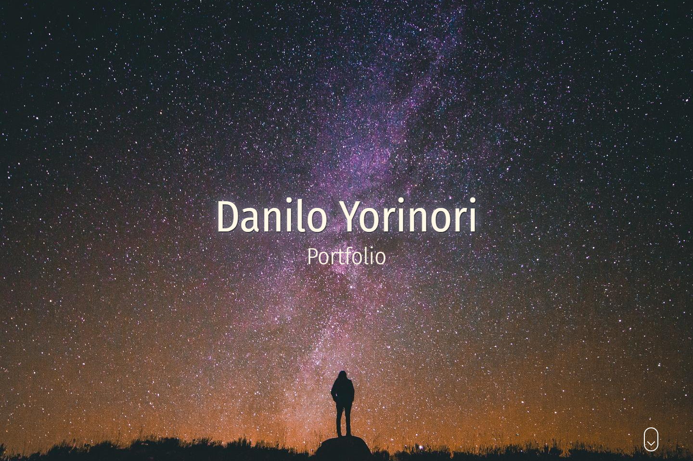

# Portfolio

<p align="center">
  <a href="https://portfolio-danilok.vercel.app/" target="blank"></a>
</p>

Portfolio created on Advanced Front-End Bootcamp from Alura.

## Technologies/frameworks

- [React](https://pt-br.reactjs.org)
- [Next.js](https://nextjs.org)

## Resources

- [Styled components](https://styled-components.com): utilises tagged template literals to style your components.
- [Styled normalize](https://www.npmjs.com/package/styled-normalize): CSS-normalize library for styled-components.
- [lodash](https://lodash.com): A modern JavaScript utility library delivering modularity, performance & extras.
- [Google Fonts](https://fonts.google.com): Making the web more beautiful, fast, and open through great typography.
- [prop-types](https://www.npmjs.com/package/prop-types): Runtime type checking for React props and similar objects. 

## Test locally

```
yarn dev
```

## Test online

This project can be tested online, to access [click here](httpa://portfolio-danilok.vercel.app).

## Credits

- [Alura](https://www.alura.com.br/)
